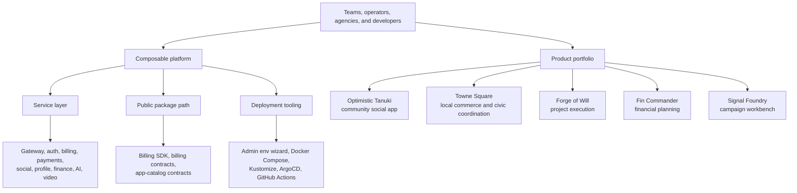

# Optimistic Tanuki Product Portfolio

Optimistic Tanuki is a product portfolio and composable web-app platform in one Nx monorepo. It ships named applications for community, local coordination, focused execution, financial planning, and marketing work on a shared Angular, NestJS, Go tooling, Docker, and Kubernetes foundation.

The short version: teams can adopt the finished products, reuse the service layer, or pull out selected developer packages without starting from a blank stack.

## Visual Story

## Choose Your Path

| If you are...                          | Start with                                                                               | What you should notice                                                   |
| -------------------------------------- | ---------------------------------------------------------------------------------------- | ------------------------------------------------------------------------ |
| evaluating the portfolio               | [docs/marketing/repo-story.md](./docs/marketing/repo-story.md)                           | named products, shared platform proof, and adoption paths                |
| comparing products                     | [docs/marketing/platform-product-matrix.md](./docs/marketing/platform-product-matrix.md) | audiences, workflows, maturity, and deployment posture                   |
| packaging a local or community product | [Towne Square](./docs/marketing/towne-square.md)                                         | local coordination, commerce, donations, sponsorships, and operator flow |
| looking for focused execution tooling  | [Forge of Will](./docs/marketing/forge-of-will.md)                                       | projects, tasks, risks, journals, timers, and delivery context           |
| exploring financial planning workflows | [Fin Commander](./docs/marketing/fin-commander.md)                                       | guided setup, scoped plans, imports, and scenario work                   |
| building repeatable marketing output   | [Signal Foundry](./docs/marketing/signal-foundry.md)                                     | structured brief, concepts, materials, exports, and refinement history   |
| integrating developer packages         | [npm Developer Packages](./docs/marketing/npm-developer-packages.md)                     | the current package surface and mirror-release posture                   |
| contributing to the monorepo           | [README.md](./README.md)                                                                 | setup, local stack, Nx workflow, and deployment model                    |

## Core Products

| Product               | Project (Nx)          | Category  | Default personality | Why this personality                                                |
| --------------------- | --------------------- | --------- | ------------------- | ------------------------------------------------------------------- |
| **Optimistic Tanuki** | `client-interface`    | Social    | `classic`           | Trustworthy, balanced baseline for a community-owned social space.  |
| **Towne Square**      | `local-hub`           | Community | `soft-touch`        | Warm, organic, gentle aesthetic for neighborhood coordination.      |
| **Forge of Will**     | `forgeofwill`         | Execution | `bold`              | High-energy, action-focused identity for project delivery momentum. |
| **Fin Commander**     | `fin-commander`       | Finance   | `professional`      | Conservative, data-driven clarity for financial planning workflows. |
| **Signal Foundry**    | `marketing-generator` | Marketing | `electric`          | Vibrant, kinetic personality for creative campaign output.          |
| **Developer Portal**  | `developer-portal`    | Developer | `architect`         | Brutalist, technical aesthetic for API docs and SDK onboarding.     |

The canonical product → personality mapping lives in code at
[`libs/theme-models/src/lib/product-personalities.ts`](./libs/theme-models/src/lib/product-personalities.ts)
and is the product-catalog source of truth for marketing docs, design-system
documentation, and comparison UI. Each app's `index.html` also sets the matching
`data-personality` for the initial render before Angular hydrates.

## Personality-Driven Design System

Every product in the portfolio is built on the same theme infrastructure but ships with a distinct **personality**: a complete design language that adapts typography, spacing, shadows, animations, borders, and color harmonies — not just colors.

- **12 predefined personalities** are registered in [`libs/theme-models/src/lib/personalities.ts`](./libs/theme-models/src/lib/personalities.ts) (classic, minimal, bold, soft, professional, playful, elegant, architect, soft-touch, electric, control-center, foundation).
- Each personality defines color-harmony rules, contrast targets, spacing/border/shadow scales, fonts, animation timing, mobile adaptations, and component presentation contracts.
- Users can switch personalities at runtime through the theme service; products only declare their **canonical default**.

See [`docs/design-system/personalities.md`](./docs/design-system/personalities.md) for the full catalog, distinctiveness matrix, and product mapping.

## Platform Proof

| Layer                 | What exists now                                                                                                                  | Why it matters                                                                           |
| --------------------- | -------------------------------------------------------------------------------------------------------------------------------- | ---------------------------------------------------------------------------------------- |
| Working products      | Multiple named Angular applications and supporting NestJS services                                                               | The platform is proven through real product surfaces, not only abstractions.             |
| Composable services   | Gateway, authentication, billing, payments, social, profile, finance, AI orchestration, prompt proxy, video, permissions, assets | Teams can deploy a capability set instead of rebuilding standard web-app infrastructure. |
| Deployment automation | Go-based admin environment wizard, Docker Compose modes, Kustomize overlays, ArgoCD application, GitHub Actions validation       | Operators get repeatable paths from catalog selection to deployable environments.        |
| Developer packages    | Billing SDK, billing contracts, app-catalog contracts, and a documented mirror-release workflow                                  | Selected pieces can be consumed without adopting the whole monorepo.                     |
| Design system         | Shared theme libraries, product-specific theme posture, reusable UI libraries                                                    | Products can share foundations while keeping distinct identities.                        |

## Positioning

Optimistic Tanuki is strongest when presented as a portfolio backed by a platform:

- **Portfolio:** named, pitchable products with clear audiences.
- **Platform:** reusable services, libraries, themes, and deployment tooling.
- **Proof:** Signal Foundry and the other apps demonstrate that the stack can support opinionated workflows end to end.

This distinction keeps the story approachable. A buyer can understand the products first, then discover the platform underneath. A developer can start with the platform and still see the product outcomes it supports.

## Current Boundaries

- Public pricing is documented as posture and vocabulary, not as a fully published commercial catalog.
- Public npm publication is routed through the mirror-repo workflow; source development remains in this monorepo.
- Hosted demos and public API references are not presented as live external surfaces unless separately deployed.
- The repository is licensed under AGPL-3.0; adopters should review [LICENSE](./LICENSE) before reuse.

## Where To Go Next

- marketing documentation index: [docs/marketing/README.md](./docs/marketing/README.md)
- messaging pillars, positioning, pitch, and FAQ: [docs/marketing/messaging-pillars.md](./docs/marketing/messaging-pillars.md)
- repo story narrative: [docs/marketing/repo-story.md](./docs/marketing/repo-story.md)
- agent prompts for generating marketing materials: [`.github/prompts/`](./.github/prompts/)
- workspace and contributor guide: [README.md](./README.md)
- documentation index: [docs/README.md](./docs/README.md)
