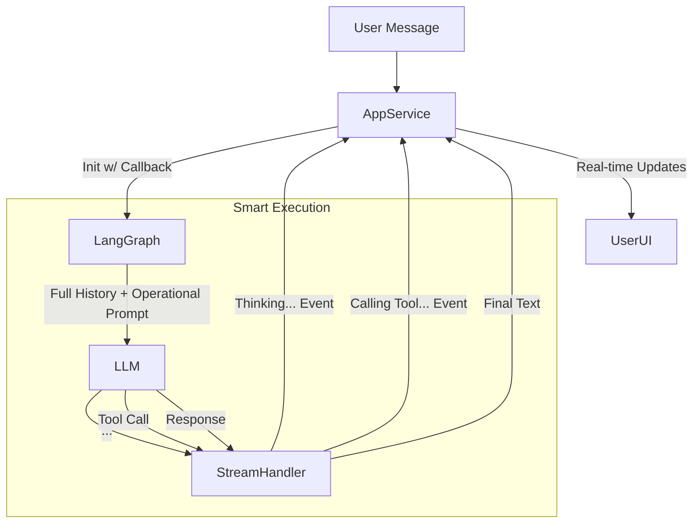

# AI Orchestration Analysis & Improvement Plan

## Current Architecture Flow

The current orchestration relies on a layered service approach, moving from the AppService (Entry) down to LangGraph (State) and LangChain (Execution).

```mermaid
flowchart TD
    UserMsg[User Message] --> AppService
    AppService --> |Init| AgentService[LangChain Agent Service]
    AppService --> |Load| ContextStorage[Context Storage (Redis)]
    AppService --> |Execute| LangGraph[LangGraph Service]
    
    subgraph LangGraph Execution
        LangGraph --> |State| WorkflowControl[Workflow Control]
        WorkflowControl --> |Classify| Decision{Workflow Type?}
        
        Decision -- Conversational --> DirectLC[LangChain Service (Direct)]
        Decision -- Tool Calling --> AgentExec[Agent Service (Executor)]
        Decision -- Hybrid --> AgentExec
    end
    
    AgentExec --> |Tools| MCP[MCP Tool Executor]
    DirectLC --> |LLM| Ollama
    AgentExec --> |LLM| Ollama
    
    Ollama --> |Stream| TokenStream[Token Stream]
    
    TokenStream --> |Thinking| Filter[Thinking Token Filter]
    TokenStream --> |Tool Events| Callback[Progress Callback]
    
    Filter --> |Clean Response| FinalResponse
    Callback --> |Notifications| ChatCollector
    FinalResponse --> |Post| ChatCollector
```

## Identified Issues

### 1. Inconsistent Tool Usage Determination
**Symptom:** The system sometimes fails to use tools when needed or tries to use them when not needed.
**Root Cause:** 
- The `WorkflowControlService` relies on a small model (`qwen2.5:3b`) or heuristics (regex keywords) to classify prompts.
- Heuristics are brittle (e.g., specific keywords like "create" trigger tools, but "help me make a project" might be missed if not covered).
- **Opacity Issue:** The user shouldn't need to know if a tool is being used; the system should seamlessly transition. Currently, the "Workflow detected" logs imply a hard switch rather than a fluid capability.

### 2. Thinking Tokens Not Streaming
**Symptom:** Users see a pause while the model "thinks", then the whole response appears, or thinking tokens are never shown.
**Root Cause:**
- **Broken Event Chain:** While `LangChainService` emits `THINKING` events, the chain of callbacks is broken or incomplete in `LangGraphService` and `AppService`.
- **AppService Implementation:** The `progress` callback in `AppService.updateConversation` currently **only** handles `tool_start` and `tool_end` events. It ignores `THINKING` events entirely.
- **LangGraph Implementation:** When using `LangChainService` directly (non-agent path), `LangGraphService` calls `executeConversation` but **does not pass the callback** for streaming events.

### 3. Thinking Tokens Leakage
**Symptom:** `<think>` tags or `[THINKING]` blocks sometimes appear in the final response.
**Root Cause:**
- **Regex Limitations:** The regex in `WorkflowControlService` covers standard DeepSeek patterns but might miss variations or malformed tags produced by quantized models.
- **Timing:** If streaming logic pushes chunks directly to the UI before filtering is complete (in a streaming scenario), the tokens leak. The current implementation buffers, filters, then returns, which *should* prevent leakage, implying the regex is missing specific patterns used by the current model version.

### 4. Unclear Immediate Goals (System Prompt)
**Symptom:** The LLM seems "lost" or generic compared to the older version.
**Root Cause:**
- **Over-Abstraction:** The new `SystemPromptBuilder` focuses heavily on "TELOS Identity" (Abstract goals/values) but lacks the **operational rigidity** of the old prompt.
- **Missing Immediate Directives:** The old prompt likely contained specific, imperative instructions ("You are X. Your immediate task is Y. Output format must be Z."). The new prompt is "You embody these values...".
- **Lost Context:** The "Conversation Summary" which previously grounded the LLM in the immediate past is sometimes sanitized or removed to prevent "prompt pollution," but this leaves the LLM without the thread of the conversation if the full history isn't processed effectively.

## Proposed Solutions

### Fix 1: Fix Streaming & Thinking Propagation
**Action:**
1. Update `AppService` callback to handle `THINKING` events and post them as system messages (or ephemeral UI events).
2. Update `LangGraphService` to pass the `onProgress` callback into `LangChainService.executeConversation`.
3. Update `LangChainAgentService` to emit thinking tokens detected during the agent stream.

### Fix 2: Strengthen Workflow & Tooling
**Action:**
1. Instead of a hard binary classifier, default to the stronger `ToolCalling` model for most interactions but with a "lazy" tool definition (only list essential tools) to reduce overhead.
2. Or, improve the `WorkflowControl` heuristics to be more semantic rather than keyword-based.

### Fix 3: Restore Operational Prompts
**Action:**
1. Modify `SystemPromptBuilder` to re-introduce **Operational Directives** alongside TELOS Identity.
2. Explicitly state the "Current Mode" (e.g., "You are in data gathering mode") based on conversation state.
3. Ensure specific constraints (like JSON formatting for non-tool outputs if required) are added back.

### Fix 4: Regex Hardening
**Action:**
1. Update `WorkflowControlService` with more aggressive thinking token patterns (including unclosed tags or variations observed in logs).

## Flow Chart (Target State)


