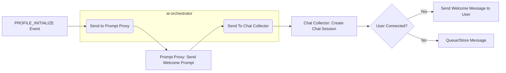

## Inital Profile startup flow

```mermaid
flowchart LR
    A[PROFILE_INITIALIZE Event] --> stpp[AI Orchestrator]
    stcc --> C[Chat Collector: Create Chat Session]
    stpp --> D[Prompt Proxy: Send Welcome Prompt]
    D --> stcc

    C --> F{User Connected?}
    F -- Yes --> G[Send Welcome Message to User]
    F -- No --> H[Queue/Store Message]

    subgraph ai-orchestrator
    stpp(Send to Prompt Proxy)
    stcc(Send To Chat Collector)
    end


```