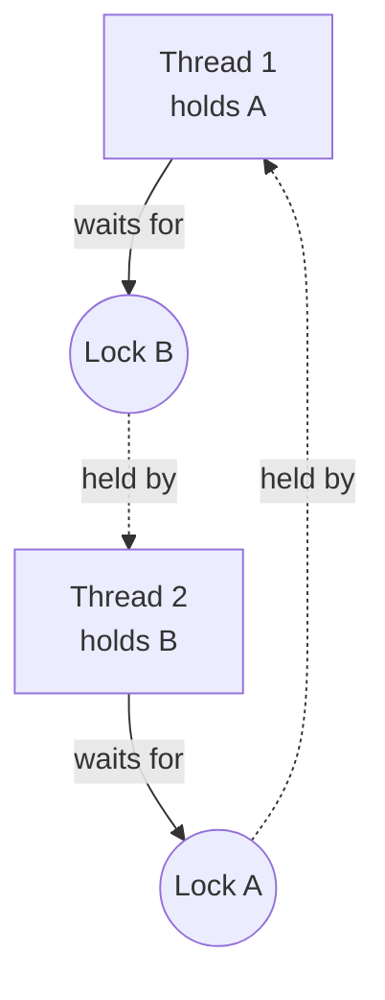

# Shared State Concurrency

Sometimes multiple threads need to access the same data. Rust makes this safe with `Mutex` and `Arc`.

## Mutex<T>

`Mutex` (mutual exclusion) ensures only one thread accesses data at a time:

```rust
use std::sync::Mutex;

let m = Mutex::new(5);

{
    let mut num = m.lock().unwrap();
    *num = 6;
}  // lock is released when MutexGuard drops

println!("{:?}", m);  // Mutex { data: 6 }
```

## Arc<T> (Atomic Reference Counter)

`Rc<T>` is not thread-safe. Use `Arc<T>` for shared ownership across threads:

```rust
use std::sync::{Arc, Mutex};
use std::thread;

let counter = Arc::new(Mutex::new(0));
let mut handles = vec![];

for _ in 0..10 {
    let counter = Arc::clone(&counter);
    let handle = thread::spawn(move || {
        let mut num = counter.lock().unwrap();
        *num += 1;
    });
    handles.push(handle);
}

for handle in handles {
    handle.join().unwrap();
}

println!("Result: {}", *counter.lock().unwrap());  // 10
```

## RwLock<T>

`RwLock` allows multiple readers OR one writer:

```rust
use std::sync::RwLock;

let lock = RwLock::new(5);

// Multiple readers can hold read locks simultaneously
{
    let r1 = lock.read().unwrap();
    let r2 = lock.read().unwrap();
    println!("{} + {} = {}", r1, r2, *r1 + *r2);
}

// Only one writer at a time
{
    let mut w = lock.write().unwrap();
    *w += 1;
}
```

## Deadlock Avoidance

Beware of deadlocks! A deadlock occurs when two threads each hold a lock the other needs:

```rust
// Potential deadlock:
let mut a = lock_a.lock().unwrap();
let mut b = lock_b.lock().unwrap();  // if another thread did this in reverse...

// Always acquire locks in the same order across threads
```

Spelled out, the "in reverse" case is thread 1 locking `A` then waiting on
`B`, while thread 2 has already locked `B` and is waiting on `A`. Each
thread holds the one lock the other needs next, so neither can proceed
and neither will ever release what it holds:



That cycle, thread 1 to B to thread 2 to A back to thread 1, is the
deadlock: no thread is broken, no data is corrupted, they are simply each
waiting on the other forever. Acquiring `A` before `B` on every thread
that touches both removes the cycle, because a thread that already holds
`A` can never be the one still waiting on it.

## Atomic Types

For simple numeric operations, `std::sync::atomic` types are faster than Mutex:

```rust
use std::sync::atomic::{AtomicUsize, Ordering};
use std::sync::Arc;

let counter = Arc::new(AtomicUsize::new(0));
let c = Arc::clone(&counter);

thread::spawn(move || {
    c.fetch_add(1, Ordering::SeqCst);
});

println!("{}", counter.load(Ordering::SeqCst));
```
