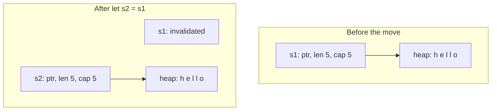

# Ownership in Rust

Ownership is Rust's most unique feature — it enables memory safety without a garbage collector.

## The Ownership Rules

1. Each value in Rust has a single **owner**.
2. There can only be **one owner** at a time.
3. When the owner goes **out of scope**, the value is dropped.

```rust
{
    let s = String::from("hello");  // s owns the String
    // use s here
}  // s goes out of scope, String is dropped (freed)
```

## Move Semantics

When you assign a heap-allocated value to another variable, ownership **moves**:

```rust
let s1 = String::from("hello");
let s2 = s1;  // s1 is moved to s2

println!("{}", s1);  // ERROR: s1 is no longer valid!
println!("{}", s2);  // OK
```

A `String` is itself a small struct on the stack (a pointer, a length, and
a capacity) pointing at the actual characters on the heap. `let s2 = s1`
copies that small struct, pointer and all, into `s2`. It does not copy the
heap data, and it does not leave `s1` holding its own now-stale copy of
the pointer either: Rust invalidates `s1` at the same moment, so there is
never a point where two owners hold the same pointer at once:



That is exactly why the compiler has to reject the use of `s1` afterward:
if it allowed both, dropping `s1` and dropping `s2` would each try to free
the same heap buffer, a double free. Refusing to compile the second
`println!` is what makes that impossible rather than just unlikely.

This prevents double-free errors without garbage collection.

## Clone

To make a deep copy, use `.clone()`:

```rust
let s1 = String::from("hello");
let s2 = s1.clone();  // deep copy

println!("{}", s1);  // OK
println!("{}", s2);  // OK
```

## Copy Types

Simple scalar types that live on the stack implement the `Copy` trait and are copied instead of moved:

```rust
let x = 5;
let y = x;  // x is copied (not moved)

println!("{}", x);  // OK — integers are Copy
println!("{}", y);  // OK
```

Types that are `Copy`: integers, floats, booleans, `char`, tuples of Copy types.

## Ownership and Functions

Passing a value to a function moves ownership:

```rust
fn takes_ownership(s: String) {
    println!("{}", s);
}  // s is dropped here

let s = String::from("hello");
takes_ownership(s);
// s can no longer be used here!
```

Return values transfer ownership back:

```rust
fn gives_ownership() -> String {
    String::from("hello")  // ownership moves to caller
}

let s = gives_ownership();  // s now owns the String
```

> **Challenge**: Fix the function to return ownership back to the caller.
