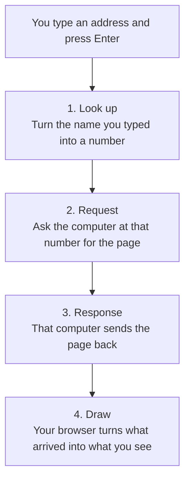

# What Happens When You Press Enter

You type an address into a browser and press Enter. Something appears a moment
later. That gap — the part between typing and appearing — is not empty. Four
distinct things happen in order, and the order is the part worth remembering:
look up, request, response, draw.

This lesson walks through all four, using no code and no product names you
have to have used. The goal is not to make you able to build one of these
systems. The goal is that the next time a page is slow, or an app says it
cannot connect, you have a mental picture of what actually failed.

Here is the whole journey on one page. Everything after this is just a
closer look at one of these four boxes:

Keep the numbers in mind. Most of the things that go wrong go wrong at one
specific step, and knowing which one is most of knowing what to do about
it. A message saying a site cannot be found is usually step one. A page
that hangs with nothing on it is usually step two or three. A page that
arrives but looks wrong is step four.

---

## Step One: Looking Up Which Computer the Address Belongs To

The address you typed — a web address, sometimes called a URL — is written for
humans. It is a name, not a location. Before anything can be requested, that
name has to be translated into the actual location of a specific computer
somewhere in the world, identified by a number.

This translation is handled by a directory service that works something like
a phone book: you give it a name, it gives you back a number. That number is
called an IP address, and every computer that can be reached over the internet
has one, the same way every landline phone has a number regardless of what
name is printed next to it in a directory.

This lookup step is often the fastest part of the whole process and usually
invisible. It is also, occasionally, the part that fails: if the directory
service cannot find an entry for the name you typed, you get an error before
a request is ever sent anywhere. That is a different failure from the ones in
the steps below, and it is worth being able to tell them apart, which the
next lesson in this module covers in more detail.

---

## Step Two: The Request Goes Out

Once your device knows which computer to talk to, it sends that computer a
request. A request is a structured message, and at its core it says something
close to: "I am looking for this specific thing — send it to me."

That message travels across a chain of intermediate points — your router,
your internet provider's equipment, and a series of other networks — before
it reaches the computer that holds what you asked for. Each point along the
way passes the message to the next, roughly the way a letter moves through
several sorting facilities before reaching the mailbox it was addressed to.
None of those intermediate points open the letter and act on it; they read
the address on the outside and forward it.

This trip is usually measured in tens or low hundreds of milliseconds, even
when the destination computer is on the other side of the planet. Distance
matters less than you would expect, because the message is not moving at the
speed of a vehicle — it is closer to the speed of light through cable and
radio.

---

## Step Three: The Response Comes Back

The computer that receives the request — covered in detail in the next
lesson — reads it, decides what it has that matches, and sends something
back. This is the response, and it is the mirror image of the request: same
kind of trip, same kind of intermediate points, just traveling in the
opposite direction.

The response usually contains more than the visible content of the page. It
carries structural information — how the content should be organized,
references to other files needed to finish building the page (images, layout
information, small pieces of interactive behavior) — and a status, a short
signal about whether the request succeeded, was misunderstood, or could not
be fulfilled at all. You have likely seen one particular status written out
as an error page: a request for something that does not exist at that
address returns a distinct, well-known signal, which is why so many "page
not found" screens look similar across completely unrelated services.

If the response does not arrive — because the connection dropped, because the
distant computer is overloaded, or because it does not exist at all — nothing
appears, and after a wait your browser gives up and tells you so. This is a
different failure again from a bad lookup in step one, and different still
from the destination server being broken, which is the subject of the fourth
lesson in this module.

---

## Step Four: The Browser Draws It

Receiving the response is not the same as showing it to you. The browser
still has to take the structural information that arrived and turn it into
the layout, text, and images on your screen. It reads the structural
description, fetches any additional files the description references — this
can mean dozens of separate small requests and responses, each following the
same look-up-request-response pattern as the first — and arranges everything
according to rules about size, position, and appearance.

This drawing step is why a page can sometimes appear to load in stages: text
first, then images filling in a moment later, then interactive elements
becoming responsive last. Each of those pieces may have come from a separate
request, sent to the same computer or to entirely different ones, all
triggered by the original response and all resolving independently.

---

## Why the Order Matters

It is tempting to think of "loading a page" as one event. Treating it as four
distinct steps — look up, request, response, draw — gives you a way to reason
about what went wrong when something does not work. A blank white screen with
no error at all often means the drawing step is still working through a large
response. An error naming the address itself often means the lookup failed.
A long wait followed by a timeout message usually means the request went out
but no response ever came back.

None of this requires knowing what is happening on the distant computer,
which is deliberately left for the next lesson. What matters here is the
shape of the trip: a name gets turned into a location, a message goes out
asking for something specific, an answer comes back, and only then does
anything appear.

---

## Best Practices

1. Remember the order — look up, request, response, draw — when something goes wrong, and use it to narrow down which step failed.
2. Treat "nothing happened" and "an error appeared" as different signals; they usually point to different steps.
3. Expect multiple requests per page, not one — a single address you typed can trigger dozens of round trips.
4. Do not assume a slow page is your device's fault; the delay can sit in any of the four steps, most of which involve computers you do not own.
