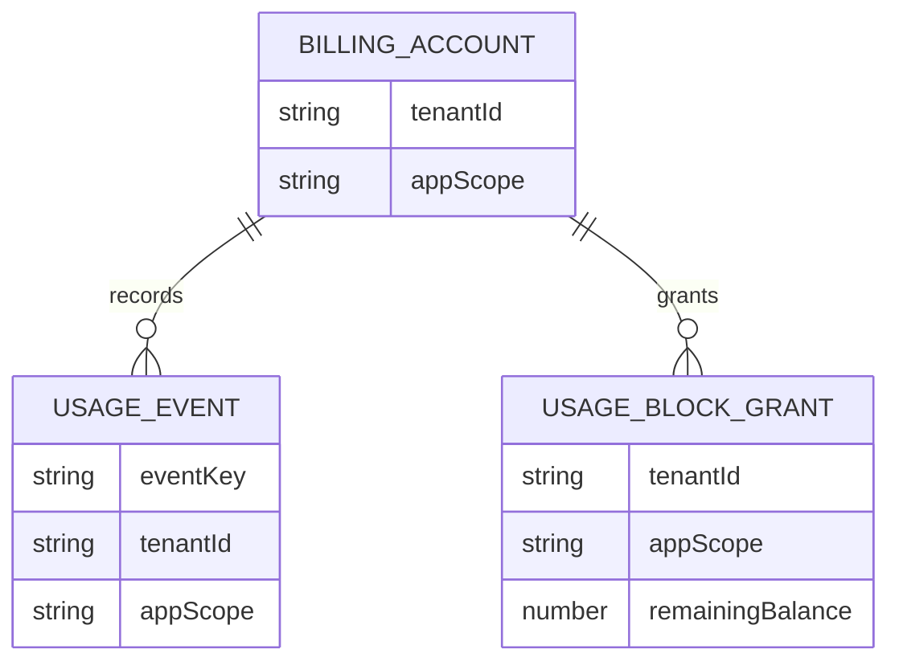

# billing-data-access Entity Relationship

```mermaid
erDiagram
  BILLING_ACCOUNT ||--o{ USAGE_EVENT : records
  BILLING_ACCOUNT ||--o{ USAGE_BLOCK_GRANT : grants

  BILLING_ACCOUNT {
    string tenantId
    string appScope
  }

  USAGE_EVENT {
    string eventKey
    string tenantId
    string appScope
  }

  USAGE_BLOCK_GRANT {
    string tenantId
    string appScope
    number remainingBalance
  }
```
