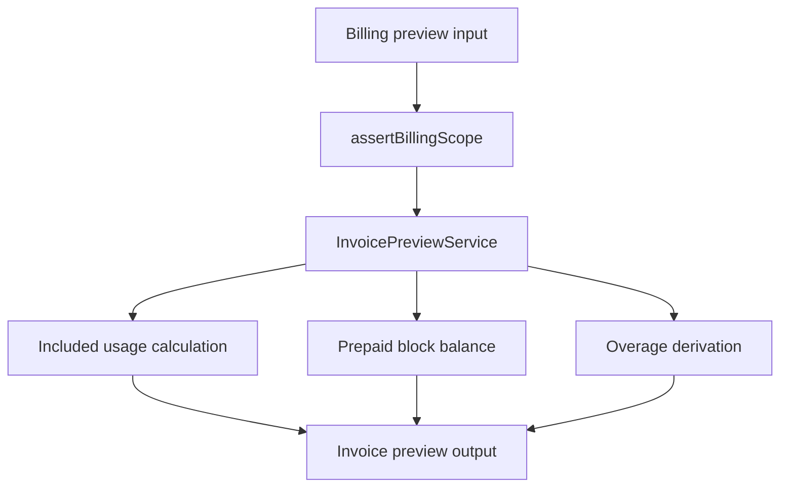

# billing-domain Invoice Preview Flow

```mermaid
flowchart TD
  Input[Billing preview input]
  Scope[assertBillingScope]
  Service[InvoicePreviewService]
  Included[Included usage calculation]
  Prepaid[Prepaid block balance]
  Overage[Overage derivation]
  Output[Invoice preview output]

  Input --> Scope
  Scope --> Service
  Service --> Included
  Service --> Prepaid
  Service --> Overage
  Included --> Output
  Prepaid --> Output
  Overage --> Output
```
