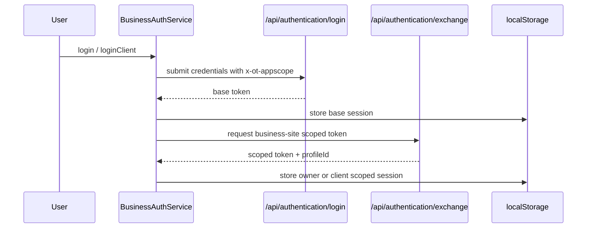

# business-data-access Auth Flow

```mermaid
sequenceDiagram
  participant User
  participant Auth as BusinessAuthService
  participant Login as /api/authentication/login
  participant Exchange as /api/authentication/exchange
  participant Storage as localStorage

  User->>Auth: login / loginClient
  Auth->>Login: submit credentials with x-ot-appscope
  Login-->>Auth: base token
  Auth->>Storage: store base session
  Auth->>Exchange: request business-site scoped token
  Exchange-->>Auth: scoped token + profileId
  Auth->>Storage: store owner or client scoped session
```
