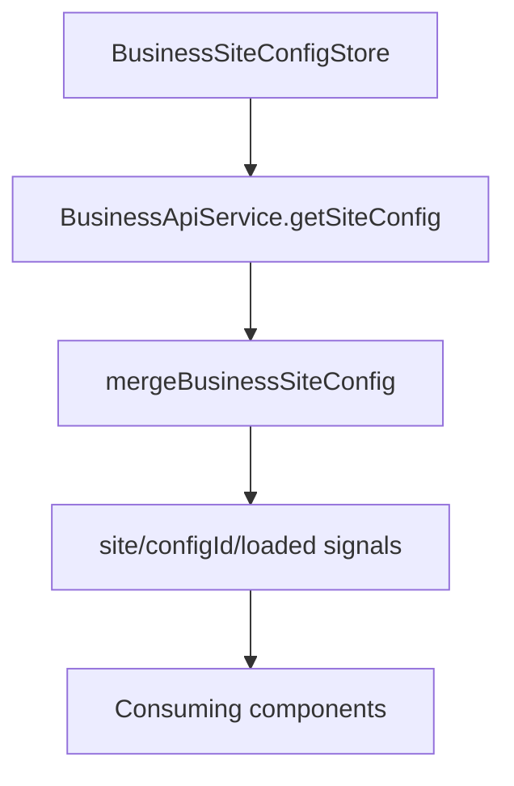

# business-data-access Config Store Flow

```mermaid
flowchart TD
  Store[BusinessSiteConfigStore]
  Api[BusinessApiService.getSiteConfig]
  Merge[mergeBusinessSiteConfig]
  Signal[site/configId/loaded signals]
  Components[Consuming components]

  Store --> Api
  Api --> Merge
  Merge --> Signal
  Signal --> Components
```
