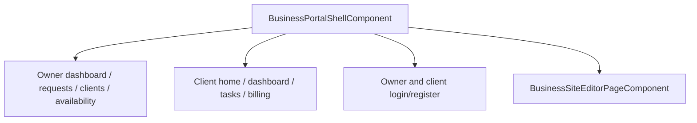

# business-portal-ui Route Map

```mermaid
flowchart TD
  Shell[BusinessPortalShellComponent]
  Owner[Owner dashboard / requests / clients / availability]
  Client[Client home / dashboard / tasks / billing]
  Auth[Owner and client login/register]
  Editor[BusinessSiteEditorPageComponent]

  Shell --> Owner
  Shell --> Client
  Shell --> Auth
  Shell --> Editor
```
