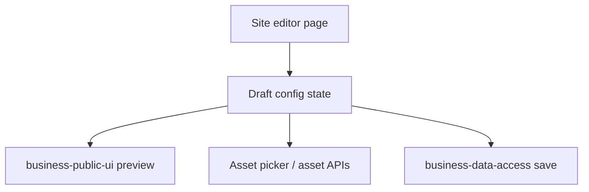

# business-portal-ui Site Editor Flow

```mermaid
flowchart TD
  Editor[Site editor page]
  Draft[Draft config state]
  Preview[business-public-ui preview]
  Assets[Asset picker / asset APIs]
  Save[business-data-access save]

  Editor --> Draft
  Draft --> Preview
  Draft --> Assets
  Draft --> Save
```
