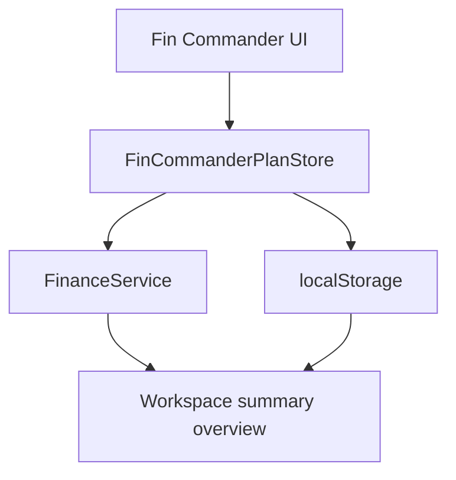

# fin-commander-data-access Data Flow

```mermaid
flowchart TD
  UI[Fin Commander UI]
  Store[FinCommanderPlanStore]
  Finance[FinanceService]
  Local[localStorage]
  Overview[Workspace summary overview]

  UI --> Store
  Store --> Finance
  Store --> Local
  Finance --> Overview
  Local --> Overview
```
