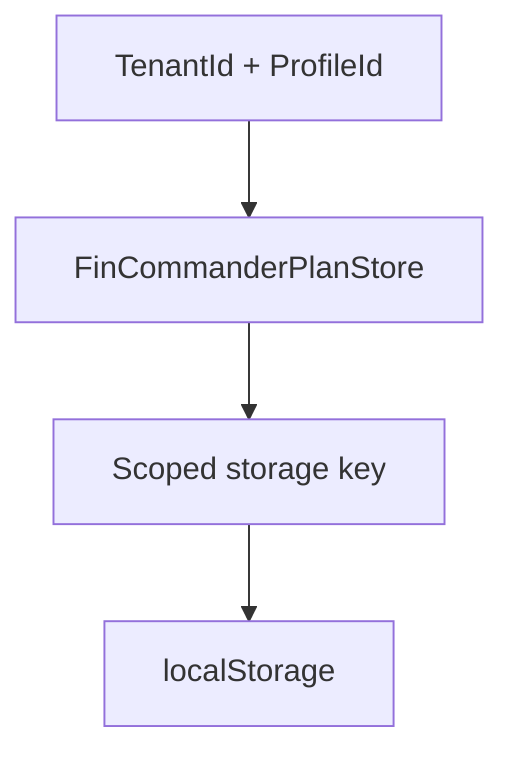

# fin-commander-data-access Scope Persistence

```mermaid
flowchart TD
  Scope[TenantId + ProfileId]
  Store[FinCommanderPlanStore]
  Key[Scoped storage key]
  Local[localStorage]

  Scope --> Store
  Store --> Key
  Key --> Local
```
