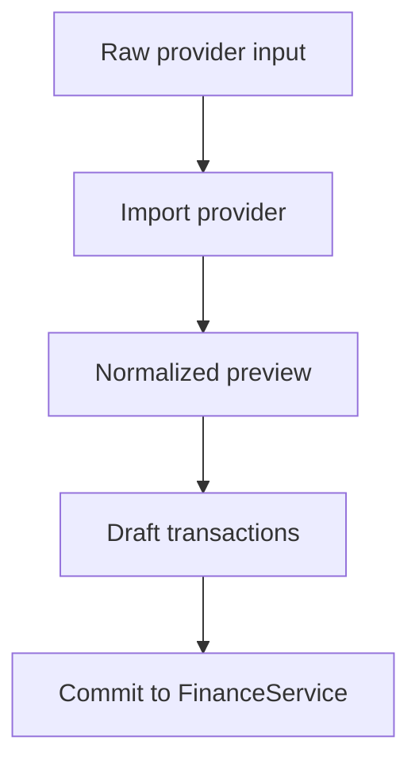

# fin-commander-imports Import Pipeline

```mermaid
flowchart TD
  Raw[Raw provider input]
  Provider[Import provider]
  Preview[Normalized preview]
  Draft[Draft transactions]
  Commit[Commit to FinanceService]

  Raw --> Provider
  Provider --> Preview
  Preview --> Draft
  Draft --> Commit
```
