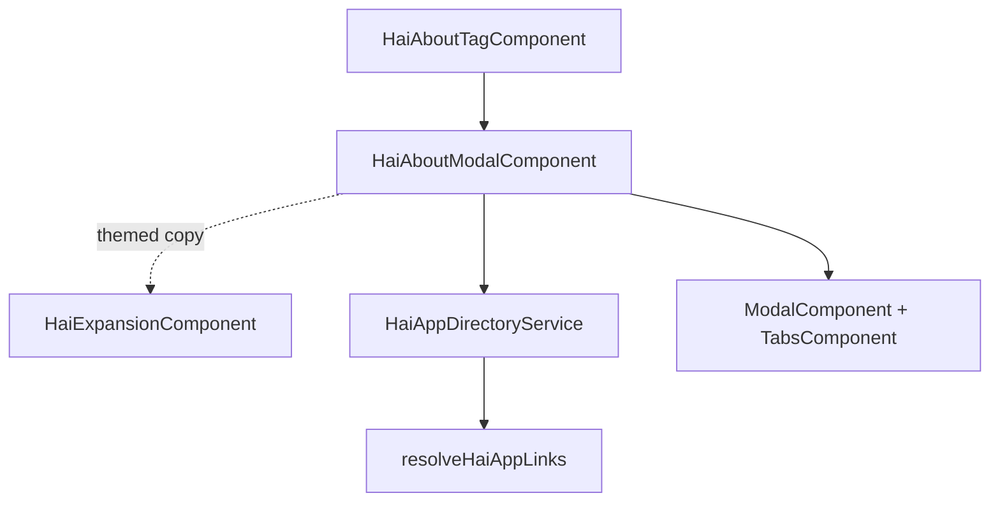

# hai-ui Component Relationship Diagram

```mermaid
flowchart TD
  Tag[HaiAboutTagComponent]
  Modal[HaiAboutModalComponent]
  Expansion[HaiExpansionComponent]
  DirectoryService[HaiAppDirectoryService]
  Directory[resolveHaiAppLinks]
  CommonUI[ModalComponent + TabsComponent]

  Tag --> Modal
  Modal --> DirectoryService
  DirectoryService --> Directory
  Modal --> CommonUI
  Modal -. themed copy .-> Expansion
```
