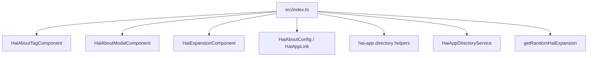

# hai-ui Export Map

```mermaid
flowchart TD
  Index[src/index.ts]
  Tag[HaiAboutTagComponent]
  Modal[HaiAboutModalComponent]
  Expansion[HaiExpansionComponent]
  Config[HaiAboutConfig / HaiAppLink]
  Directory[hai-app.directory helpers]
  DirectoryService[HaiAppDirectoryService]
  Copy[getRandomHaiExpansion]

  Index --> Tag
  Index --> Modal
  Index --> Expansion
  Index --> Config
  Index --> Directory
  Index --> DirectoryService
  Index --> Copy
```
