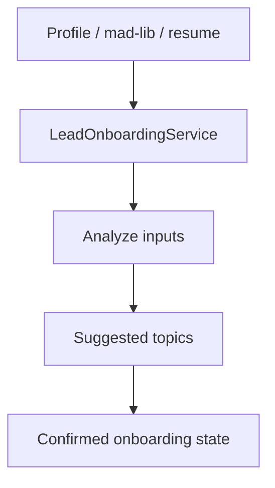

# leads-feature-onboarding Topic Generation Flow

```mermaid
flowchart TD
  Profile[Profile / mad-lib / resume]
  Service[LeadOnboardingService]
  Analyze[Analyze inputs]
  Topics[Suggested topics]
  Confirm[Confirmed onboarding state]

  Profile --> Service
  Service --> Analyze
  Analyze --> Topics
  Topics --> Confirm
```
