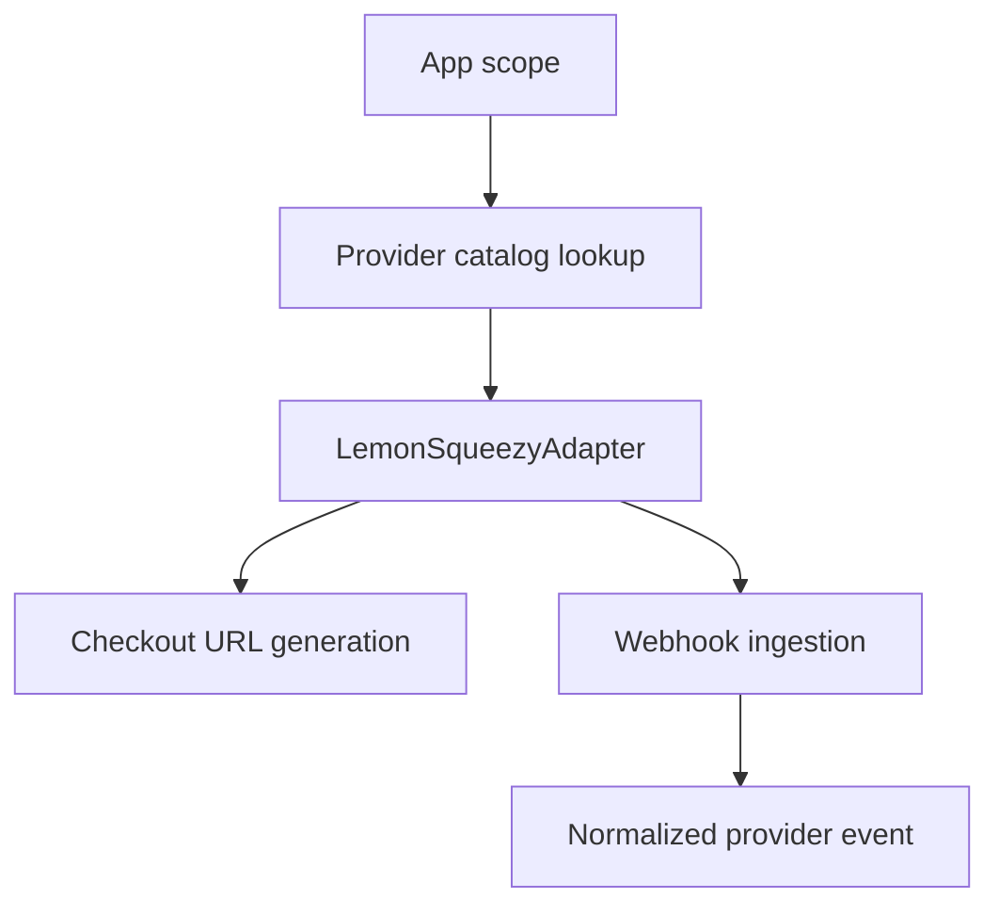

# payments-domain Provider Flow

```mermaid
flowchart TD
  Scope[App scope]
  Catalog[Provider catalog lookup]
  Adapter[LemonSqueezyAdapter]
  Checkout[Checkout URL generation]
  Webhook[Webhook ingestion]
  Normalized[Normalized provider event]

  Scope --> Catalog
  Catalog --> Adapter
  Adapter --> Checkout
  Adapter --> Webhook
  Webhook --> Normalized
```
