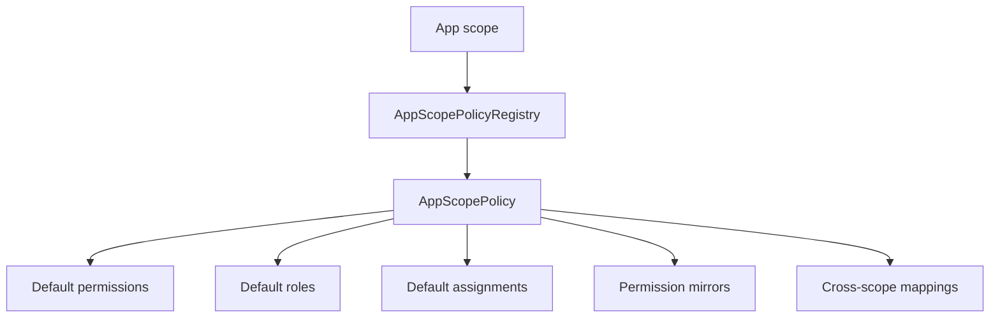

# permissions-domain Policy Flow

```mermaid
flowchart TD
  Scope[App scope]
  Registry[AppScopePolicyRegistry]
  Policy[AppScopePolicy]
  Permissions[Default permissions]
  Roles[Default roles]
  Assignments[Default assignments]
  Mirrors[Permission mirrors]
  CrossScope[Cross-scope mappings]

  Scope --> Registry
  Registry --> Policy
  Policy --> Permissions
  Policy --> Roles
  Policy --> Assignments
  Policy --> Mirrors
  Policy --> CrossScope
```
