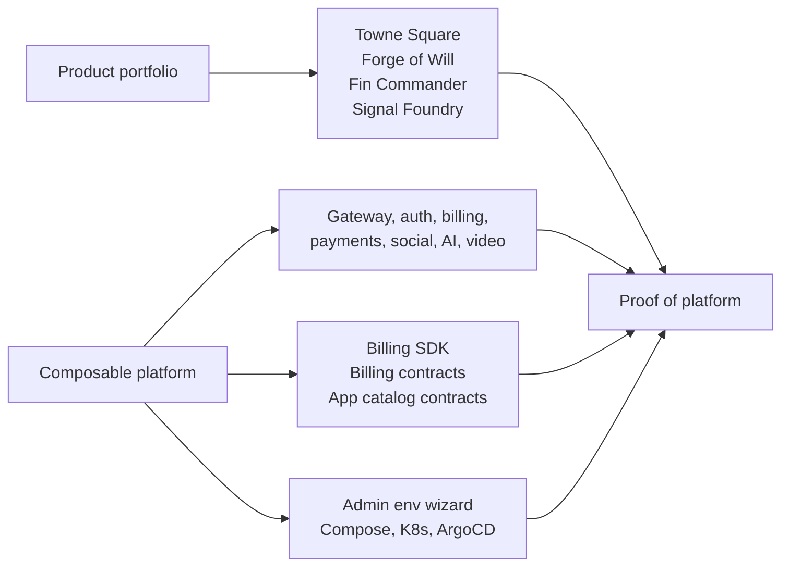

# Marketing Documentation

This section turns the repository into a pitchable story. It is organized for people evaluating the products, the platform underneath them, or the developer package surface.

## Start Here

| Audience                             | Read this first                                                    | Use it to understand                                                  |
| ------------------------------------ | ------------------------------------------------------------------ | --------------------------------------------------------------------- |
| external evaluator                   | [Repo Story](./repo-story.md)                                      | the whole portfolio-platform-proof narrative                          |
| product buyer or operator            | [Platform Product Matrix](./platform-product-matrix.md)            | which product fits which audience and workflow                        |
| community or local-commerce operator | [Towne Square](./towne-square.md)                                  | local coordination, classifieds, donations, and sponsorships          |
| execution-focused team               | [Forge of Will](./forge-of-will.md)                                | project delivery, risks, journals, timers, and context                |
| finance workflow evaluator           | [Fin Commander](./fin-commander.md)                                | guided setup, scoped plans, imports, and scenarios                    |
| marketer or launch team              | [Signal Foundry](./signal-foundry.md)                              | campaign briefs, concepts, materials, exports, and refinement history |
| developer                            | [npm Developer Packages](./npm-developer-packages.md)              | current package surfaces and mirror-release posture                   |
| platform or ops team                 | [Admin Environment Wizard Demo Script](./admin-env-demo-script.md) | generated deployment from catalog selection to live gateway           |

## Visual Story

## Product One-Pagers

- [Towne Square](./towne-square.md) frames the local-first community and commerce surface.
- [Forge of Will](./forge-of-will.md) frames the focused project-execution surface.
- [Fin Commander](./fin-commander.md) frames the guided financial-workflow surface.
- [Signal Foundry](./signal-foundry.md) frames the marketing campaign workbench and the clearest proof-of-platform case study.

Each one-pager uses the same structure: audience, promise, workflow, proof, deployment posture, and call to action.

## Platform And Developer Materials

- [Repo Story](./repo-story.md) connects the products, service layer, deployment tooling, and package path into one pitch.
- [Platform Product Matrix](./platform-product-matrix.md) compares the main marketed surfaces by audience, workflow, billing posture, deployment posture, and maturity.
- [npm Developer Packages](./npm-developer-packages.md) explains the current public package surface and release path.
- [Admin Environment Wizard Demo Script](./admin-env-demo-script.md) gives an ops-oriented walkthrough from generated deployment output to a live gateway contract.
- [Service Offerings](./service-offerings.md), [Library Offerings](./library-offerings.md), and [Pricing Models](./pricing-models.md) capture current packaging vocabulary and constraints.
- [Design System: Personalities](../design-system/personalities.md) catalogs the 12 personalities, the canonical product mapping, and the distinctiveness matrix used by the theme system.

## Current Boundaries

- Public pricing language is posture and vocabulary, not a published commercial price sheet.
- Public npm publication depends on the mirror-repo workflow; source development remains in this monorepo.
- Hosted demos and public API references should not be implied unless those external surfaces are deployed.
- Product claims should stay anchored to repo evidence: application READMEs, service docs, deployment docs, package metadata, and test coverage.
