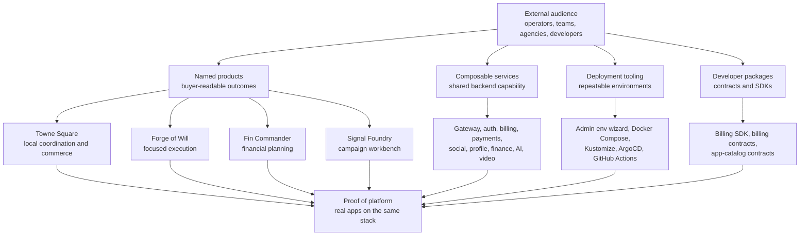

# Repo Story

Optimistic Tanuki is easiest to understand as a product portfolio backed by a composable platform. The products give the story a human entrypoint. The platform explains why those products can share services, deployment patterns, themes, and package surfaces without becoming one undifferentiated app.

## Positioning Statement

Optimistic Tanuki is a composable web application platform that ships named products for community coordination, local commerce, financial planning, project execution, and marketing campaigns on a common Angular, NestJS, Go tooling, Docker, and Kubernetes foundation.

Teams can adopt it three ways:

- as a **product portfolio** with deployable applications
- as a **service layer** with reusable backend capabilities
- as a **developer toolbox** with selected npm-ready packages and shared contracts

## Visual Story

## The Three Pillars

### Product Portfolio

The portfolio names concrete outcomes before asking anyone to understand the monorepo. Towne Square addresses local coordination and commerce. Forge of Will addresses project execution. Fin Commander addresses financial planning workflows. Signal Foundry addresses repeatable campaign creation. Optimistic Tanuki itself remains the broader community and social surface.

This matters because the repository can otherwise look like infrastructure first. The product names make the work approachable and pitchable.

### Composable Service Layer

The platform includes backend services for gateway composition, authentication, billing, payments, social flows, profiles, permissions, finance, video, AI orchestration, prompts, assets, and related content workflows. The value proposition is not just that these services exist. It is that they can support multiple products and deployment shapes from one workspace.

The strongest operator message is: choose the capabilities you need, generate the deployment surface, and expose the matching gateway contract.

### Developer Toolbox

The public package path gives developers a smaller adoption route than cloning the whole monorepo. The current package story centers on billing helpers, billing contracts, and app-catalog contracts, with a mirror-repo publication workflow documented separately.

The message is conservative: these packages are selected public surfaces, while the monorepo remains the source of development.

## Proof Points

| Proof                       | Repo-backed evidence                                                                                                | Marketing use                                                              |
| --------------------------- | ------------------------------------------------------------------------------------------------------------------- | -------------------------------------------------------------------------- |
| named products              | `client-interface`, `local-hub`, `forgeofwill`, `fin-commander`, `marketing-generator`, `developer-portal`          | show product outcomes before platform complexity                           |
| working services            | gateway, authentication, billing, payments, social, profile, finance, videos, AI orchestration, permissions, assets | show reusable capability behind the apps                                   |
| deployment automation       | `tools/admin-env-wizard`, Docker Compose workflows, Kustomize overlays, ArgoCD application, GitHub Actions          | show repeatability and operator seriousness                                |
| public package path         | `billing-sdk`, `billing-contracts`, `app-catalog-contracts`, public-package registry, mirror workflow               | show lightweight developer adoption path                                   |
| design foundation           | shared theme docs and UI libraries                                                                                  | show that products can share foundations while keeping distinct identities |
| test and validation posture | e2e projects, catalog checks, package checks, CI workflows                                                          | support credibility without overclaiming production completeness           |

## Pitch Flow

Use this order in external conversations:

1. Lead with the buyer's product problem.
2. Name the relevant product and its workflow.
3. Show that the product is backed by a shared platform, not a one-off build.
4. Use deployment tooling and packages as credibility proof for technical audiences.
5. Be explicit about current boundaries: unpublished pricing, mirror-based package release, and no assumed public hosted demo.

## Useful Follow-Ups

- [Product Overview](../../PRODUCT.md)
- [Marketing Documentation](./README.md)
- [Platform Product Matrix](./platform-product-matrix.md)
- [npm Developer Packages](./npm-developer-packages.md)
- [Admin Environment Wizard Demo Script](./admin-env-demo-script.md)
