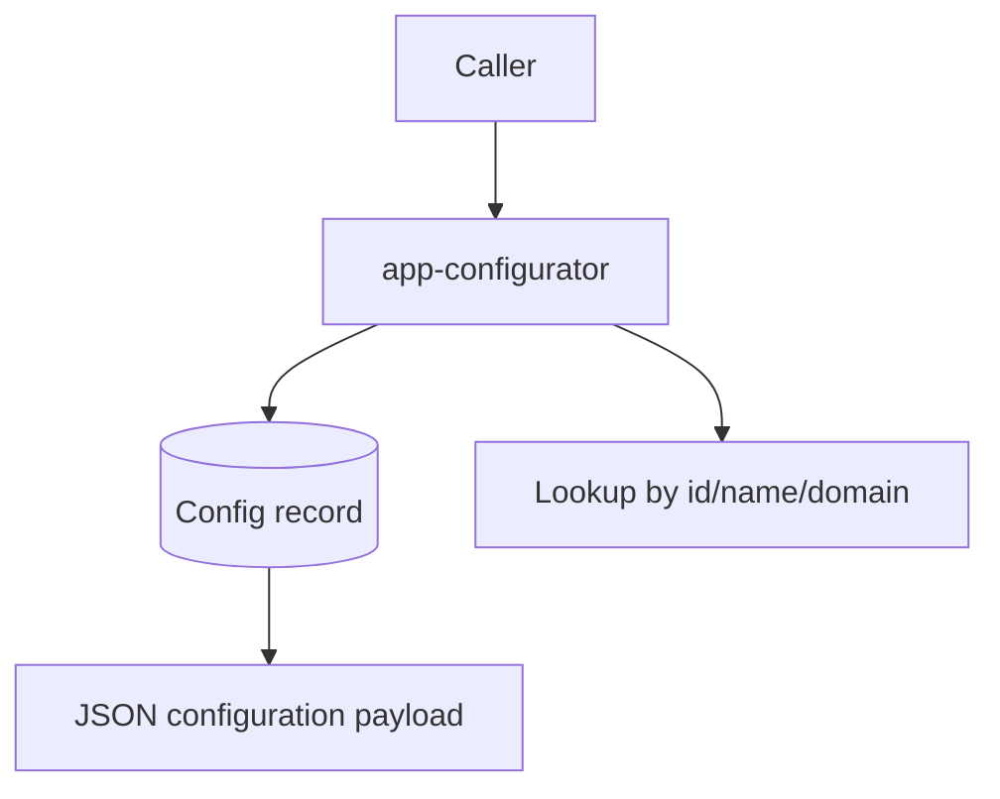

# App Configurator Config Document Flow

```mermaid
flowchart TD
  Caller[Caller]
  Service[app-configurator]
  Record[(Config record)]
  JSON[JSON configuration payload]
  Lookup[Lookup by id/name/domain]

  Caller --> Service
  Service --> Record
  Record --> JSON
  Service --> Lookup
```
