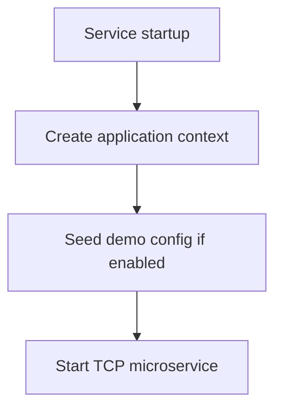

# App Configurator Startup Flow

```mermaid
flowchart TD
  Start[Service startup]
  Context[Create application context]
  Seed[Seed demo config if enabled]
  Boot[Start TCP microservice]

  Start --> Context
  Context --> Seed
  Seed --> Boot
```
