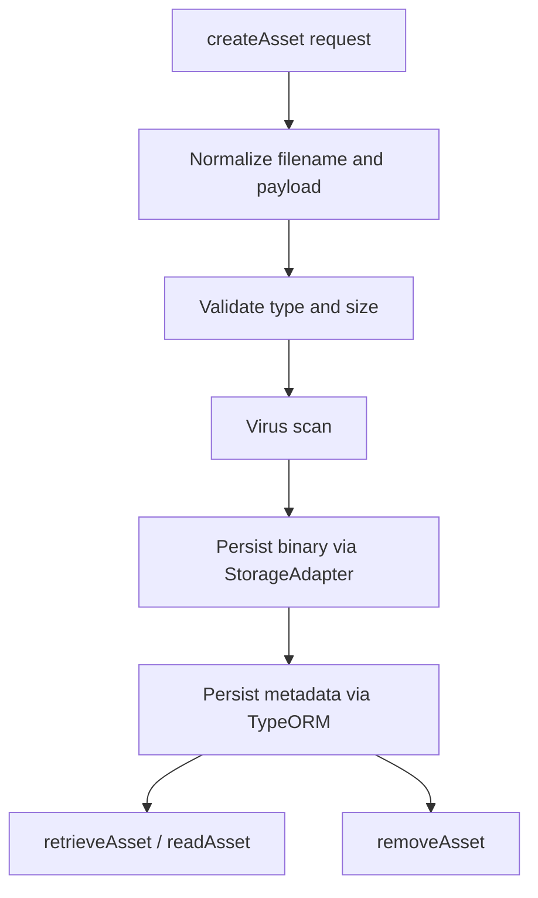

# Assets Lifecycle

```mermaid
flowchart TD
  Create[createAsset request]
  Normalize[Normalize filename and payload]
  Validate[Validate type and size]
  Scan[Virus scan]
  PersistBlob[Persist binary via StorageAdapter]
  PersistMeta[Persist metadata via TypeORM]
  Retrieve[retrieveAsset / readAsset]
  Remove[removeAsset]

  Create --> Normalize
  Normalize --> Validate
  Validate --> Scan
  Scan --> PersistBlob
  PersistBlob --> PersistMeta
  PersistMeta --> Retrieve
  PersistMeta --> Remove
```
