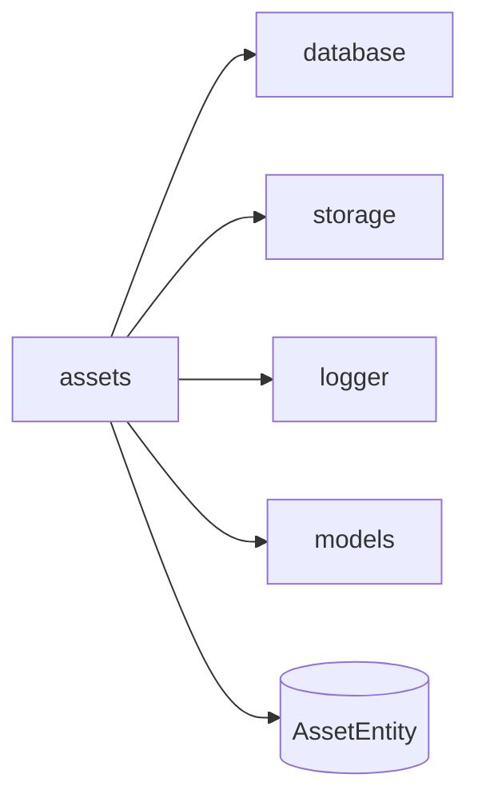

# Assets Dependency Diagram

```mermaid
flowchart LR
  Assets[assets]
  Database[database]
  Storage[storage]
  Logger[logger]
  Models[models]
  AssetEntity[(AssetEntity)]

  Assets --> Database
  Assets --> Storage
  Assets --> Logger
  Assets --> Models
  Assets --> AssetEntity
```
