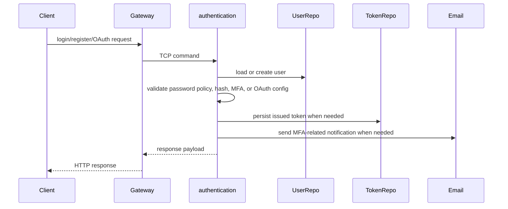

# Authentication Flow

```mermaid
sequenceDiagram
  participant Client
  participant Gateway
  participant Auth as authentication
  participant UserRepo
  participant TokenRepo
  participant Email

  Client->>Gateway: login/register/OAuth request
  Gateway->>Auth: TCP command
  Auth->>UserRepo: load or create user
  Auth->>Auth: validate password policy, hash, MFA, or OAuth config
  Auth->>TokenRepo: persist issued token when needed
  Auth->>Email: send MFA-related notification when needed
  Auth-->>Gateway: response payload
  Gateway-->>Client: HTTP response
```
