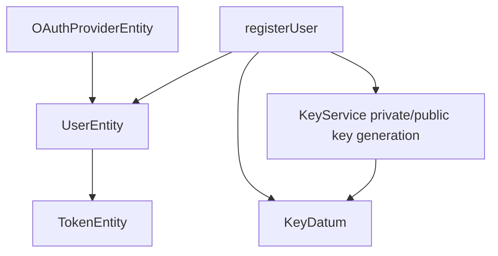

# Authentication Data Model Flow

```mermaid
flowchart TD
  Register[registerUser]
  User[UserEntity]
  Key[KeyDatum]
  Token[TokenEntity]
  OAuth[OAuthProviderEntity]
  Keys[KeyService private/public key generation]

  Register --> User
  Register --> Key
  Register --> Keys
  Keys --> Key
  User --> Token
  OAuth --> User
```
