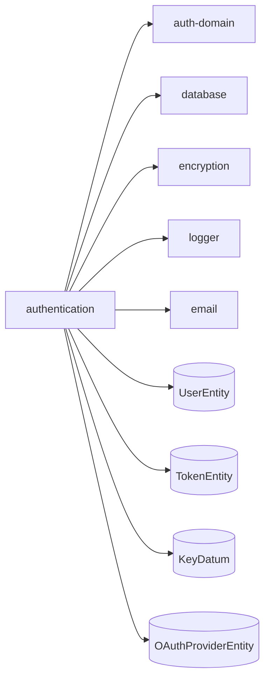

# Authentication Dependency Diagram

```mermaid
flowchart LR
  Auth[authentication]
  AuthDomain[auth-domain]
  Database[database]
  Encryption[encryption]
  Logger[logger]
  Email[email]
  User[(UserEntity)]
  Token[(TokenEntity)]
  Key[(KeyDatum)]
  OAuth[(OAuthProviderEntity)]

  Auth --> AuthDomain
  Auth --> Database
  Auth --> Encryption
  Auth --> Logger
  Auth --> Email
  Auth --> User
  Auth --> Token
  Auth --> Key
  Auth --> OAuth
```
