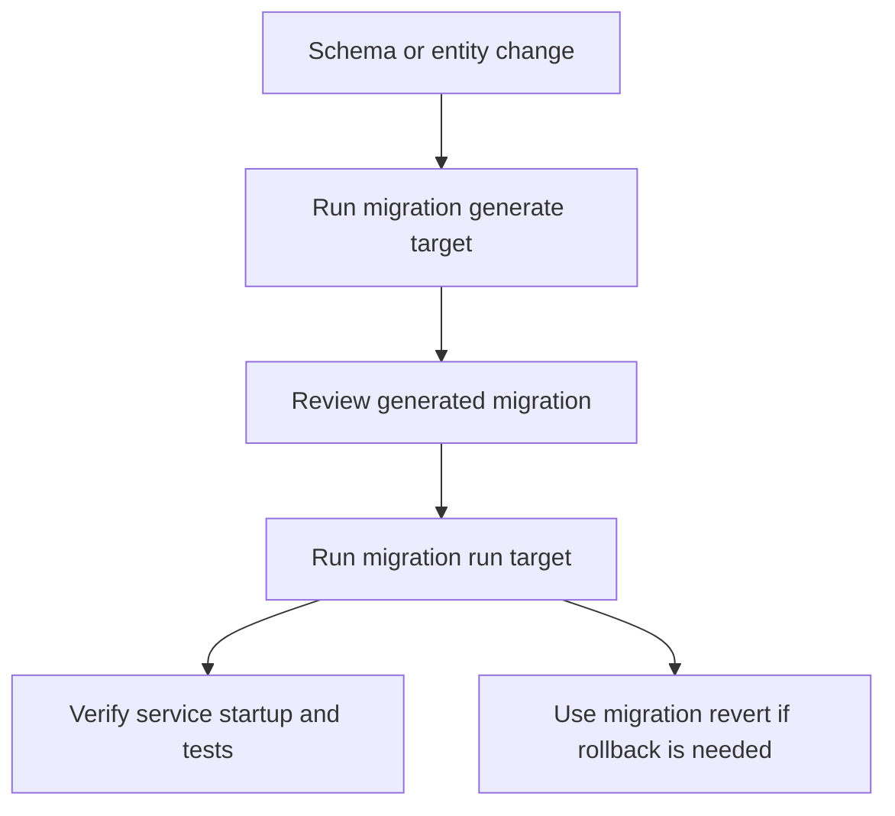

# Authentication Migration Procedure

```mermaid
flowchart TD
  Start[Schema or entity change]
  Generate[Run migration generate target]
  Review[Review generated migration]
  Apply[Run migration run target]
  Verify[Verify service startup and tests]
  Revert[Use migration revert if rollback is needed]

  Start --> Generate
  Generate --> Review
  Review --> Apply
  Apply --> Verify
  Apply --> Revert
```
