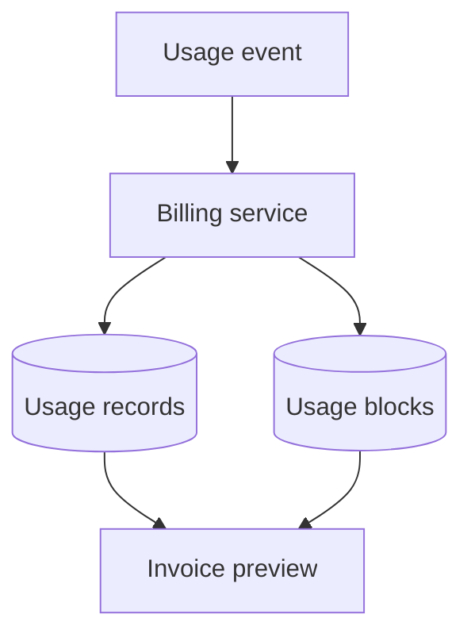

# Billing Data Flow

```mermaid
flowchart TD
  Event[Usage event]
  Service[Billing service]
  Usage[(Usage records)]
  Blocks[(Usage blocks)]
  Preview[Invoice preview]

  Event --> Service
  Service --> Usage
  Service --> Blocks
  Usage --> Preview
  Blocks --> Preview
```
