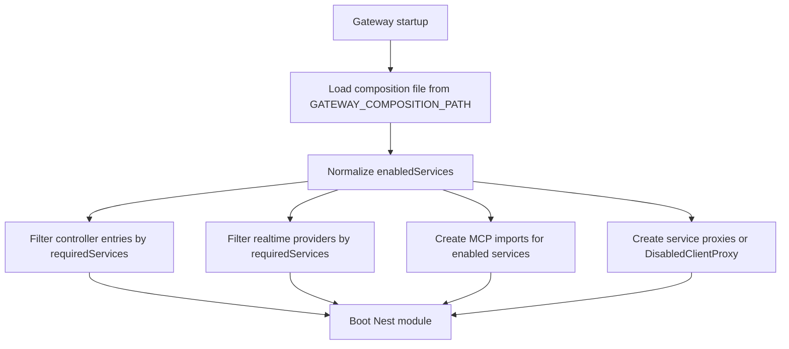

# Gateway Composition Diagram

```mermaid
flowchart TD
  Start[Gateway startup]
  LoadComp[Load composition file from GATEWAY_COMPOSITION_PATH]
  Normalize[Normalize enabledServices]
  FilterControllers[Filter controller entries by requiredServices]
  FilterRealtime[Filter realtime providers by requiredServices]
  CreateImports[Create MCP imports for enabled services]
  CreateProxies[Create service proxies or DisabledClientProxy]
  Boot[Boot Nest module]

  Start --> LoadComp
  LoadComp --> Normalize
  Normalize --> FilterControllers
  Normalize --> FilterRealtime
  Normalize --> CreateImports
  Normalize --> CreateProxies
  FilterControllers --> Boot
  FilterRealtime --> Boot
  CreateImports --> Boot
  CreateProxies --> Boot
```
