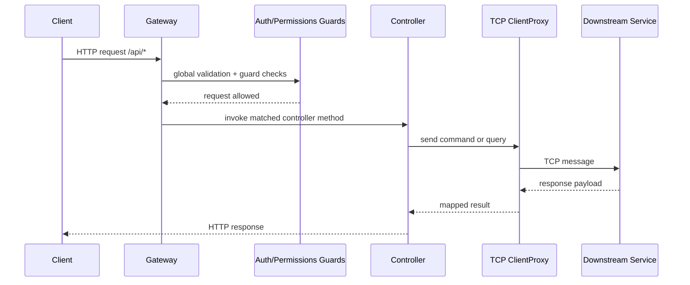

# Gateway Request Flow

```mermaid
sequenceDiagram
  participant Client
  participant Gateway
  participant Guard as Auth/Permissions Guards
  participant Controller
  participant Proxy as TCP ClientProxy
  participant Service as Downstream Service

  Client->>Gateway: HTTP request /api/*
  Gateway->>Guard: global validation + guard checks
  Guard-->>Gateway: request allowed
  Gateway->>Controller: invoke matched controller method
  Controller->>Proxy: send command or query
  Proxy->>Service: TCP message
  Service-->>Proxy: response payload
  Proxy-->>Controller: mapped result
  Controller-->>Client: HTTP response
```
