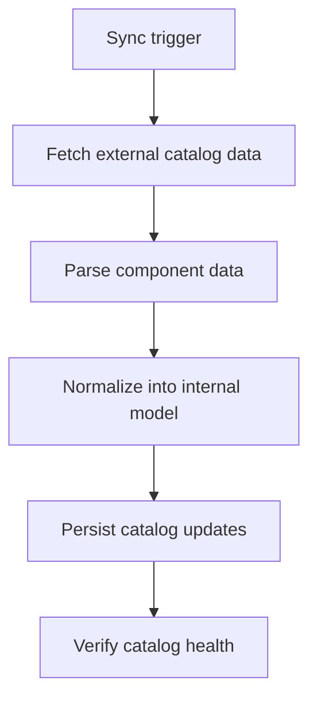

# System Configurator API Catalog Sync Flow

```mermaid
flowchart TD
  Trigger[Sync trigger]
  Fetch[Fetch external catalog data]
  Parse[Parse component data]
  Normalize[Normalize into internal model]
  Persist[Persist catalog updates]
  Verify[Verify catalog health]

  Trigger --> Fetch
  Fetch --> Parse
  Parse --> Normalize
  Normalize --> Persist
  Persist --> Verify
```
