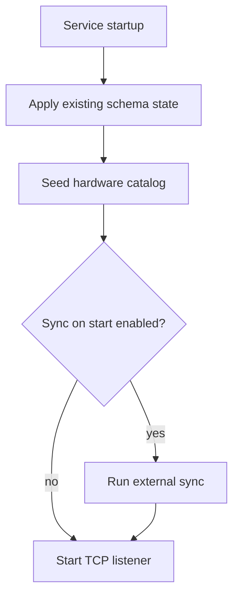

# System Configurator API Startup Flow

```mermaid
flowchart TD
  Start[Service startup]
  Migrate[Apply existing schema state]
  Seed[Seed hardware catalog]
  SyncCheck{Sync on start enabled?}
  Sync[Run external sync]
  Listen[Start TCP listener]

  Start --> Migrate
  Migrate --> Seed
  Seed --> SyncCheck
  SyncCheck -->|yes| Sync
  SyncCheck -->|no| Listen
  Sync --> Listen
```
