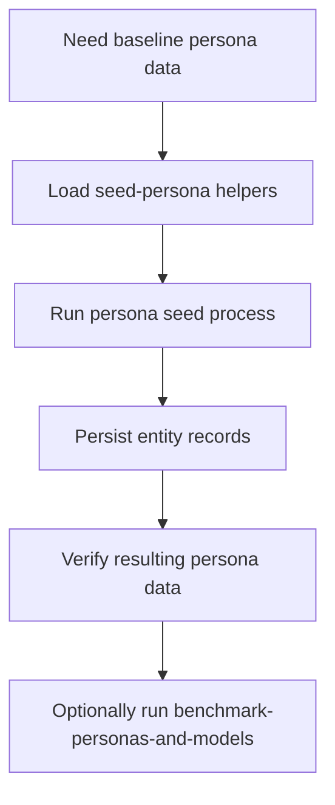

# Telos Docs Service Seeding Procedure

```mermaid
flowchart TD
  Start[Need baseline persona data]
  Helpers[Load seed-persona helpers]
  Seed[Run persona seed process]
  Persist[Persist entity records]
  Verify[Verify resulting persona data]
  Benchmark[Optionally run benchmark-personas-and-models]

  Start --> Helpers
  Helpers --> Seed
  Seed --> Persist
  Persist --> Verify
  Verify --> Benchmark
```
