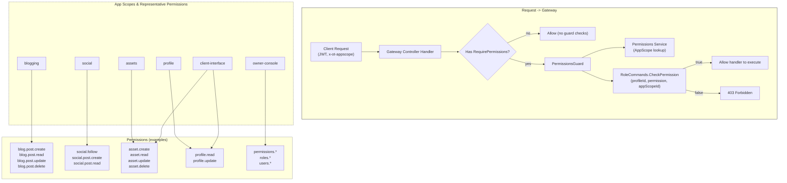
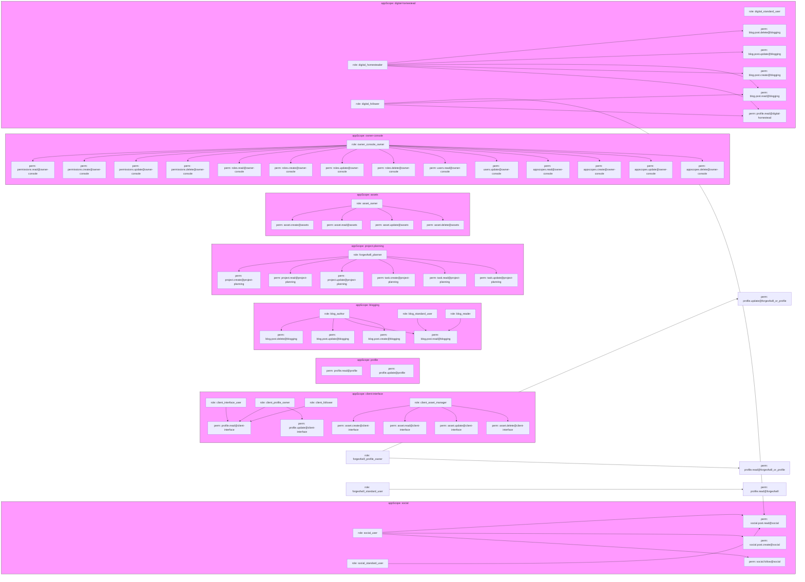

# Permissions audit — matrix & diagram

Summary
- Source: `apps/permissions/src/assets/default-permissions.json` (seed).
- Enforcement model in gateway:
  - Decorator: `RequirePermissions(...permissions)` sets metadata key `permissions`.
  - Guard: `PermissionsGuard` reads `x-ot-appscope` header, resolves app scope via Permissions microservice, and calls `RoleCommands.CheckPermission` for each permission with `{ profileId, permission, appScopeId }`.
  - If no decorator on handler/class, guard allows access (no requirement).
- Key implication: permissions are checked per app-scope (header-driven) and per-profileId (extracted from authenticated request). Controllers must be annotated with `RequirePermissions(...)` and/or use `UseGuards(PermissionsGuard)`.

Permissions matrix (condensed)
- client-interface
  - profile.read — read profile for client UI
  - profile.update — update profile via client UI
  - asset.create / asset.read / asset.update / asset.delete — full asset CRUD for client UI
- profile
  - profile.read — service reads profile
  - profile.update — profile writes
- blogging
  - blog.post.create — create blog posts
  - blog.post.read — read blog posts
  - blog.post.update — update posts
  - blog.post.delete — delete posts
- project-planning
  - project.create / project.read / project.update
  - task.create / task.read / task.update
- social
  - social.follow — follow/unfollow operations
  - social.post.create — create social posts
  - social.post.read — read social posts
- assets
  - asset.* — same CRUD semantics as client-interface but scoped to assets service
- owner-console (admin)
  - permissions.*, roles.*, users.*, appscopes.* — management CRUD

Notes on mapping & enforcement
- Permission token naming is resource.action (e.g., `blog.post.create`). The guard expects exact permission strings.
- App scope resolution is mandatory: `x-ot-appscope` header must be set or `PermissionsGuard` will reject.
- Some permissions appear across multiple app scopes (e.g., `profile.read` in both `profile` and `client-interface`): ensure controllers use the correct app-scope header to disambiguate.
- Default behavior: if a handler has no `RequirePermissions(...)` metadata, the guard treats it as publicly allowed (i.e., no permission check). This means missing decorators are the primary gap.

Actionable next steps (short)
- Annotate controllers that should be guarded with `RequirePermissions(...)` and ensure requests include `x-ot-appscope`.
- Add unit tests for `PermissionsGuard` covering: missing header, missing app-scope, user without profileId, permission denied, permission allowed.
- Add integration tests that verify gateway → permissions service → microservice flows for representative endpoints (e.g., blogging post.create, social.follow).

Mermaid diagram — overall flow & key scopes

